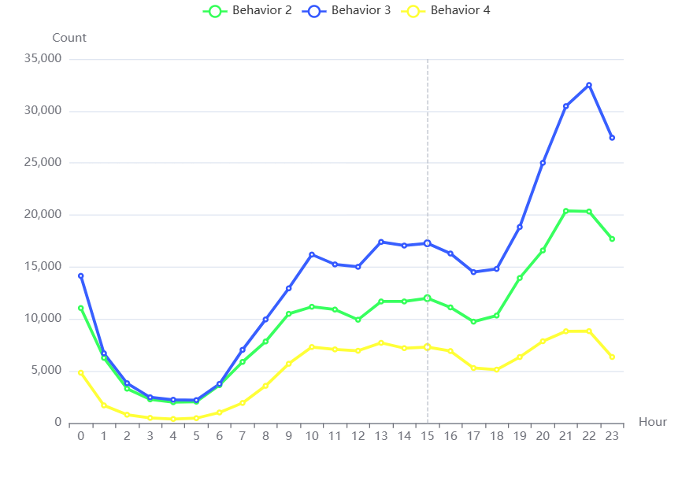
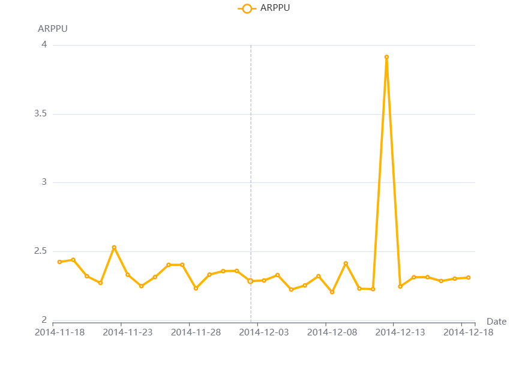

# spark_class
## 1. 研究目的
本项目基于淘宝用户购物行为数据，旨在利用大数据处理技术深入分析用户行为模式，为电商平台和商家提供数据驱动的决策支持。通过对访问量、转化率和用户价值的分析，我们希望揭示用户在电商平台上的行为规律，从而提升平台效率和用户体验。  
* 流量分析：访问量（PV）/独立访问量（UV）是多少，通过分析PV/UV能发现什么规律？
* 漏斗分析：用户“浏览-收藏-加购-购买”的转化率是怎样的？哪一步的折损比例最大？
* 用户价值分析：对电商平台什么样的用户是有价值的？如果作为商家，要重点关注哪部分用户？
### 数据描述

## 2. 研究方法
采用mapreduce、spark和flink三种不同方法进行数据分析并比较不同方法在此任务上的性能表现。
### mapreduce执行
## 3. 研究结果
### 流量分析
#### 1.基于天级别访问流量分析
  
不管是PV还是UV趋势，均在12号的时候出现了一个尖峰，说明双十二电商节的用户集中消费导致的变化  

#### 2.基于小时级别访问流量分析
  
可以看出，PV的高峰值出现在20点之后，可能的原因是淘宝的主力消费人群是工薪阶层，这部分群体在下班后开始使用淘宝浏览购物；UV的值比较恒定，上午10点之后便没有出现大的波动，一个可能的原因是用户早晨也会刷一下淘宝，比如看看物流状态，UV值在一天之内就不会再有大的变化波动了。 另外也可以看出，凌晨2点之后，PV/UV的趋势一致，均是一天中流量最小的时间段。  
#### 3.双十二当天访问流量分析
  
  
为了方便对比，我们和30日总体的小时级别PV/UV变化趋势做对比发现，双十二当天，PV变化趋与一个月内的PV变化趋势基本一致，只不过曲线不太平滑，多出来小的凸点，一个可能的原因是大促当天，有整点领券活动，通过推送等形式会有效拉动用户使用淘宝。UV变化趋势稍有不同，可以看到双十二当天在晚上8点之后UV出现了小高峰，表明了大促当天用户的消费意愿还是比较强烈。
#### 4.不同用户行为流量分析
  
可以看出4种行为按照小时的变化趋势基本一致，都是在晚上8点之后有明显增长，凌晨2-6点是低峰  
### 用户价值分析
#### 1.用户购买频次分析
  
可以看到，大部分用户的购买次数均不超过50次，这期间还包括了双十二当天的集中购物，排除双十二高峰，实际消费次数会更少。当然也有部分用户的购买次数超过百次，甚至有超过800次的，高频消费的用户可以看作是忠实的超级用户。
#### 2.ARPU分析
ARPU(Average Revenue Per User) 表示每日的收益在所有活跃用户中的转化。详细的描述为，每日的所有收益与每日的活跃的用户数量有关，因此可以通过ARPU来计算，每日活跃用户对每日收益的转化效率。
该数据集中没有对金额的体现。那我们可以对ARPU这个指标做一些修改，改为度量平台活跃用户每日平均消费次数。  
  
可以看到，活跃用户每天平均消费次数在0.5次左右，双十二期间达到最高值接近2，是平时的4倍左右，表明用户会集中在大促日的时候购买。
#### 3.ARPPU分析
ARPPU(average revenue per paying user)是指从每位付费用户中获得的收益，它反映的是整个平台的用户消费的均值。
它的计算方式为：ARPPU = 总收入/活跃用户付费数量。但是在该数据集中没有收益金额，因此我们可以对计算方式做一点转化，将总收入转化为总的购买行为次数。  
  
可以看到，针对活跃的下单用户来讲，平均每日消费次数在2-2.5次之间波动，双十二当天该数值达超过3.75，一个可能的原因是用户会在平时把喜欢的商品进行加购，等到双十二促销当天再下单购买。
#### 4.复购周期分析
  
可以看出，大部分用户的复购行为发生在5天之内，在第5天复购的行为出现了明显的拐点，如果这个时候采取营销策略提升用户的购买意图，增加更多收益。超过15天后，复购的意愿基本已经趋于0，此时可以考虑采取一些召回策略，增加复购的可能性，防止用户的流失。

## 4. 分工
洪蔚伦同学贡献25%，负责mapreduce模块  
李佳骥同学贡献25%，负责spark模块  
曾令扬同学贡献25%，负责flink模块  
张逸敏同学贡献25%，负责可视化模块
